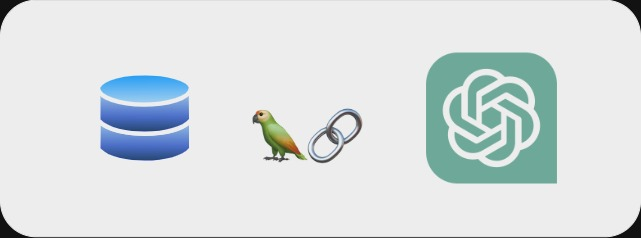

# Ask The Site

Using LLMs and Vector Databases for information retrieval over a website

A LangChain Powered app to query the contents of your website.

## Sample Usage

Head over to the home page in the web app and follow the instructions


#### Preloaded Vector DB Demo

https://github.com/JayantTaneja/Ask-The_Site/assets/79043865/257ee581-9d9b-42e8-ae4f-d66c050d0c3e

#### Create your own Vector DB


https://github.com/JayantTaneja/Ask-The_Site/assets/79043865/e931074b-af6d-47c0-9f80-b1e111501487


#### Query your own vector db


https://github.com/JayantTaneja/Ask-The_Site/assets/79043865/c1386b30-b3b4-4410-b1d3-d826a29c563b


### Features

- Crawls the url specified to generate a sitemap that is subsequently used to extract text data from the relevant webpages on that site
- Filter URL patterns using Regex
- Creates Vector DB (ChromaDB) of crawled pages using OpenAi embeddings
- Uses vector db:
    - To perform Similarity Search and fetch relevant links containing the contents similar to query
    - Use GPT-3.5 Turbo to simulate chatbot behaviour on the website's data

### Running Locally:

```bash
>>> git clone https://github.com/JayantTaneja/Ask-The_Site.git
>>> pip install streamlit
>>> cd Ask-The_Site
>>> pip install -r requirements.txt
>>> streamlit run Home.py
```

### How is it different from ChatGPT?
ChatGPT is a fine tuned GPT model capable of performing dialogue generation or 'chat' based on the knowledge/data stored in its weights. It is incapable of querying over an existing external knowledge base.

Using a vector db however, we can leverage the general knowledge of the LLM (GPT 3.5 turbo, in this case) to gain actionable results.

### But Newer GPT-4 Interfaces allow you to search the web?
True, however, they rely on publically available information. Let's suppose you, at your company/organization have some private data that you do not want to expose for the purpose of preventing any data leaks. In such a case, embedding it in a vector db is a good alternative.

Secondly, With the framework LangChain, you have the option of using a locally hosted LLM like LLaMa(assuming you have necessary compute power). This web app aims to showcase the potential of such layouts.
